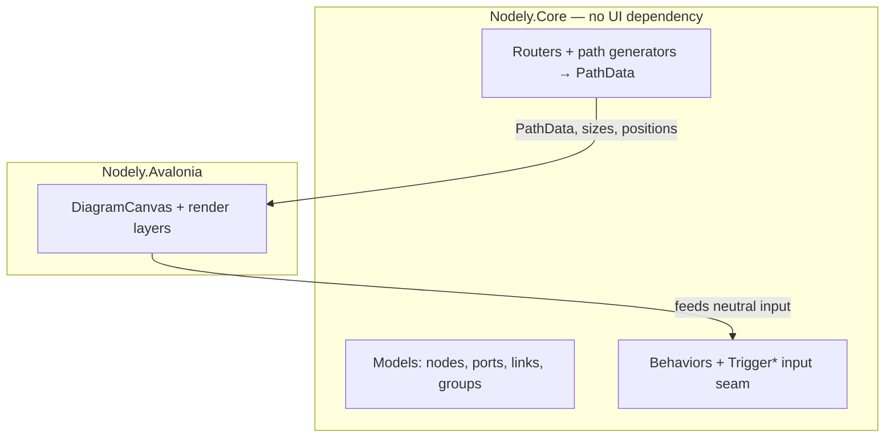
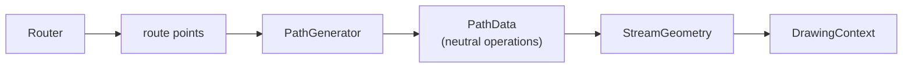
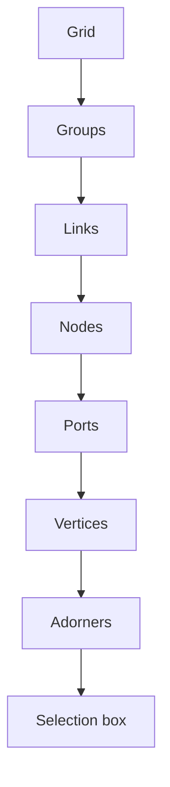

# Architecture

You don't need to read this to use Nodely, but if you want to extend it — or you're just curious why it's built
the way it is — this page explains the shape of the thing.

## A core that knows nothing about the UI

The single most important decision is that the engine is UI-agnostic. `Nodely.Core` has no reference to
Avalonia. It owns the models, the behaviors, the routers, and the path generators, and it talks to the outside
world through its own neutral pointer, key, and wheel events. The Avalonia layer sits on top, translating real
input into those neutral events and drawing whatever the core produces.

The practical payoff is that all the interesting logic — graph structure, routing, selection, undo — can be
tested without a window, and the same engine could in principle drive a different renderer.

## PathData instead of SVG strings

Blazor.Diagrams describes link paths as SVG `d` strings. Nodely couldn't do that and still drop the browser, so
it replaced them with `PathData`: an ordered list of `Move`, `Line`, `Cubic`, `Quad`, and `Close` operations.
A path generator produces `PathData`; the Avalonia layer turns it into a `StreamGeometry` and draws it.

Keeping that seam neutral turned out to pay for itself many times over. Link hit-testing measures the distance
from the cursor to the `PathData` with plain math, so it works without any rendering surface. Labels are placed
by walking the same path data. Even markers — including the circle, which is approximated with four béziers —
are just `PathData` that the renderer fills. None of it touches SVG or JavaScript.

## What Avalonia gives back

Three things the browser version leaned on have clean native equivalents:

- **Node sizing.** Instead of a `ResizeObserver`, Avalonia measures the node's control and Nodely writes the
  result back to `NodeModel.Size`.
- **The canvas origin.** Instead of `getBoundingClientRect`, it reads the control's bounds and feeds them to the
  engine.
- **Drawing.** Instead of SVG paths and CSS, it draws in `Render(DrawingContext)` with `StreamGeometry` and a
  `Pen`.

## How the canvas is layered

The `DiagramCanvas` is a stack of layers, drawn back to front. Nodes, ports, and groups are real Avalonia
controls — that's what lets you template them with anything. The grid, the links, and the bend-point handles
are drawn in immediate mode, where being cheap matters more than being a control. A single pan/zoom transform
is shared across the layers, so everything stays in step as you move around.

Reading top to bottom, that's also the order things sit in front of one another: the grid is furthest back, the
selection box is on top.

## The seams, in one place

Most of the design exists so you can extend it without forking. Each of these is a stable contract with a
sensible default:

| When you want to… | Reach for |
| --- | --- |
| Render a node, port, or group your way | `RegisterNode` / `RegisterPort` / `RegisterGroup` |
| Draw or restyle a link | `RegisterLink` / `RegisterLinkStyle` |
| Add any overlay | `AddLayer` + `DiagramLayer` |
| Change how a link routes or draws | `Router`, `PathGenerator` |
| Change where a link attaches | an `Anchor` |
| Change the interaction rules | a `Behavior`, or the `CanConnect` / `CanDrag` / `SnapPosition` delegates |
| Lay the graph out | `IDiagramLayout` |
| Theme it | `NodelyPalette` |

The [Extensibility](./guides/extensibility.md) guide walks through them with examples.

## Performance, concretely

On a desktop development machine, a diagram of 2,000 nodes and roughly 4,000 links re-routes and regenerates all
its smooth-bézier paths in about 15 ms, lays out in about 31 ms, and serializes and reloads in about 61 ms.
Links cache their geometry and only rebuild it when the link actually changes, and nodes outside the viewport
are virtualized away.
