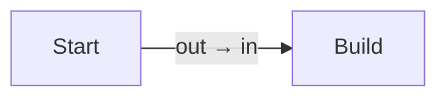

# Getting started

## Install

Add the Avalonia package — it pulls in the core engine with it:

```bash
dotnet add package Nodely.Avalonia
```

If you need to save diagrams or arrange them automatically, add those packages too:

```bash
dotnet add package Nodely.Serialization   # JSON save / load
dotnet add package Nodely.Algorithms      # auto-layout & graph queries
```

## Your first canvas

A `DiagramCanvas` is just an Avalonia control. You give it a `NodelyDiagram` to drive, put some nodes and links
in that diagram, and drop the canvas into your layout. Here's the whole thing:

```csharp
using Nodely;
using Nodely.Avalonia.Controls;
using Nodely.Models;
using Point = Nodely.Geometry.Point;

var diagram = new NodelyDiagram();

// Two nodes...
var start = diagram.Nodes.Add(new NodeModel(new Point(120, 220)) { Title = "Start" });
var build = diagram.Nodes.Add(new NodeModel(new Point(420, 160)) { Title = "Build" });

// ...connected through a pair of ports.
var output = start.AddPort(PortAlignment.Right);
var input = build.AddPort(PortAlignment.Left);
diagram.Links.Add(new LinkModel(output, input));

// Show an arrowhead on every link.
diagram.Options.Links.DefaultTargetMarker = LinkMarker.Arrow;

var canvas = new DiagramCanvas { Diagram = diagram };
```

That `canvas` goes anywhere an Avalonia control can — a `Window`, a `UserControl`, a `Grid` cell. From there the
canvas takes over: it measures your nodes, routes the links, and handles panning, zooming, and selection
without any further wiring.

The diagram you just built looks like this:



## What you get for free

As soon as a canvas is on screen, the usual editor gestures already work:

- **Pan** by dragging empty space, and **zoom** with the mouse wheel.
- **Select** by clicking a node or a link, marquee-select with `Shift`+drag, or grab everything with `Ctrl`+`A`.
- **Move** nodes by dragging them, **connect** them by dragging out from a port, and **delete** with `Delete`.
- **Undo and redo** with `Ctrl`+`Z` and `Ctrl`+`Y`.
- **Copy, cut, paste, and duplicate** with the usual `Ctrl`+`C` / `X` / `V` / `D`, or from the right-click menu.

## A few common settings

Most of the knobs you'll reach for early live on the canvas or the diagram's options:

```csharp
canvas.Palette = NodelyPalettes.Light;   // the theme (Dark is the default)
canvas.IsReadOnly = true;                 // an inspector: you can look and pan, but not edit
canvas.ZoomToFit();                       // frame whatever is on the canvas
diagram.Options.GridSize = 24;            // snap dragged nodes to a 24-pixel grid
```

Once you have a canvas running, the natural next step is making the nodes look like *your* data — that's
[Custom nodes](./guides/custom-nodes.md). For copyable app patterns, including command-aware toolbars and
custom overlays, see [Recipes](./guides/recipes.md).
