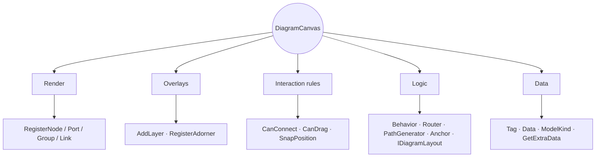

# Extensibility

Nodely is built to stay small. Rather than ship an option for every feature anyone might want, it gives you a
handful of well-defined hooks and trusts you to build the rest. This page is the tour of those hooks.



## Render anything

Nodes, ports, and groups are all templatable by model type, and the resolution rule is the same for each: the
most specific factory you've registered wins, and unregistered types fall back to the built-in look.

```csharp
canvas.RegisterNode<TaskNode>(node => new Border { /* any Avalonia control */ });
canvas.RegisterPort<MyPort>(port => new Ellipse { Width = 10, Height = 10 });
canvas.RegisterGroup<MyGroup>(group => new Border { /* group chrome */ });
```

Links are the exception, and for a good reason: they're drawn in immediate mode to stay fast, so instead of
handing back a control you register a drawer. You can lean on the default and add to it, or take over completely
using the path geometry you're given:

```csharp
canvas.RegisterLink<FlowLink>((context, ctx) =>
{
    ctx.DrawDefault();   // the standard stroke, markers, and labels...
    // ...then add your own — a gradient, a dashed overlay, an animated dot — from ctx.Geometry or ctx.Path
});
```

The context hands you the link, a ready-to-draw `Geometry`, the neutral `Path`, the `Palette`, whether it's
selected, and the marker positions. When all you want is a different stroke or a dash pattern, skip the drawer
and use a style resolver instead:

```csharp
canvas.RegisterLinkStyle<FlowLink>((link, ctx) => link.Locked
    ? new LinkStyle { Stroke = Brushes.Gray, DashStyle = DashStyle.Dash }
    : LinkStyle.Default);
```

## Add your own overlay

`AddLayer` is the one to remember, because it's the seam that lets you build features Nodely will never ship.
Drop a control into the canvas — above the content, below the adorners — and you can draw rulers, alignment
guides, a heatmap, annotations, anything. A world-space layer (the default) shares the diagram's pan and zoom
and draws in diagram coordinates; a screen-space one stays put in the viewport.

```csharp
public sealed class GridRulerLayer : DiagramLayer // the base gives you Owner and Diagram
{
    public override void Render(DrawingContext ctx)
    {
        if (Diagram is null) return;
        // draw in diagram coordinates — the canvas keeps the transform synced and repaints on view changes
    }
}

canvas.AddLayer(new GridRulerLayer());        // world-space by default
canvas.AddLayer(myHud, worldSpace: false);    // pinned to the viewport
canvas.RemoveLayer(myHud);
```

## Decorate the selection

If you want a toolbar floating over a selected node, or a badge, or your own resize handles, register an adorner
provider. The control you return is anchored at the node's top-left corner; nudge it into place from there with a
margin or a transform. Return null to skip a node.

```csharp
canvas.RegisterAdorner(node => new Button
{
    Content = "Edit",
    Margin = new Thickness(0, -32, 0, 0), // float it above the node
});
```

## Set the rules

A few small delegates gate the built-in interactions, so you usually don't have to write a behavior at all:

```csharp
// reject connections you don't allow — no self-loops here
diagram.Options.Links.CanConnect = (link, target) => link.Source.Model != target;

// keep certain models from being dragged
diagram.Options.CanDrag = movable => movable is not NodeModel { Locked: true };

// snap to your own grid
diagram.Options.SnapPosition = p => new Point(Math.Round(p.X / 50) * 50, Math.Round(p.Y / 50) * 50);
```

## Custom behaviors

When you need more than a rule, write a behavior. A `Behavior` subscribes to the diagram's neutral input — the
same `PointerDown`, `PointerMove`, `KeyDown`, and `Wheel` events the built-ins use, fed in from Avalonia by the
canvas — and you register it like any other:

```csharp
public sealed class HoverHighlightBehavior : Behavior
{
    public HoverHighlightBehavior(Diagram diagram) : base(diagram) => Diagram.PointerMove += OnMove;
    private void OnMove(Model? model, PointerEvent e) { /* ... */ }
    public override void Dispose() => Diagram.PointerMove -= OnMove;
}

canvas.RegisterBehavior(new HoverHighlightBehavior(diagram));
canvas.UnregisterBehavior<PanBehavior>();   // or drop a built-in you don't want
```

## Carry your own data

Every model has a `Tag` for a single object and a lazily-allocated `Data` bag for named values, so you rarely
need to subclass just to stash something:

```csharp
node.Tag = myDomainObject;
node.Data["status"] = "active";
```

For data that should survive a save and reload, override the snapshot hooks on your model instead — they're
covered in [Save & load](./serialization.md):

```csharp
public override IReadOnlyDictionary<string, object?> GetExtraData() =>
    new Dictionary<string, object?> { ["Status"] = Status };

public override void SetExtraData(IReadOnlyDictionary<string, object?> data) =>
    Status = data.TryGetValue("Status", out var v) && v is string s ? s : Status;
```

## Pluggable algorithms

Routing, path generation, and layout are all open contracts. Implementing `IDiagramLayout`, for instance, lets
your own layout drop straight into the same flow as the built-in one:

```csharp
public sealed class CircularLayout : IDiagramLayout
{
    public void Arrange(Diagram diagram) { /* position the nodes */ }
}

canvas.RunAsUndoableMove(() => new CircularLayout().Arrange(diagram)); // one undo step
```

## The whole map

| What you want to change | The seam |
| --- | --- |
| How a node, port, or group looks | `RegisterNode` / `RegisterPort` / `RegisterGroup` |
| How a link is drawn or styled | `RegisterLink` / `RegisterLinkStyle` |
| Any extra overlay | `AddLayer` + `DiagramLayer` |
| Adorners on the selection | `RegisterAdorner` |
| The interaction rules | `CanConnect` / `CanDrag` / `SnapPosition` |
| A whole new interaction | `Behavior` + `RegisterBehavior` |
| Where a link attaches | an `Anchor` (`DynamicAnchor`, `LinkAnchor`, …) |
| How links route and draw | `Router` / `PathGenerator` |
| How the graph is laid out | `IDiagramLayout` |
| The colors | `NodelyPalette` |
| Data on a model | `Tag` / `Data` / `ModelKind` / `GetExtraData` |
| What gets saved | `DiagramSerializer` + `DiagramSerializationRegistry` + extras |

The examples that go with these live in the demo app, not in the core packages — the whole point is that your
features stay in your code and lean on the seams.
