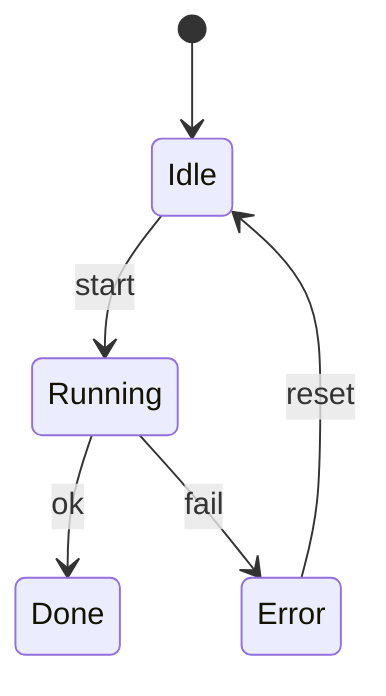

# Auto-layout & graph queries

`Nodely.Algorithms` is an optional package that can arrange a diagram for you and answer questions about it as a
graph.

```bash
dotnet add package Nodely.Algorithms
```

## Layered layout

`LayeredLayout.Arrange` sorts nodes into layers by how far they sit from a source and lines them up. The thing
that makes it actually usable is that it copes with cycles. A state machine, for example, is full of loops:



A naïve layered layout chokes on that `Error → Idle → Running → Error` loop and collapses everything into a
single column. Nodely breaks the cycles into a directed acyclic graph first, lays *that* out, then reduces edge
crossings and spaces the nodes by their real sizes around a shared centerline. So the loop above arranges into a
readable left-to-right flow instead of a pile.

Calling it is one line, and you can tune it:

```csharp
using Nodely.Algorithms;

LayeredLayout.Arrange(diagram);

LayeredLayout.Arrange(diagram, new LayeredLayoutOptions
{
    Horizontal = true,        // layers run left to right; false runs top to bottom
    LayerSpacing = 120,       // gap between layers
    NodeSpacing = 40,         // gap between nodes in a layer
    CrossingIterations = 4,   // how hard to work at untangling edges (0 turns it off)
});
```

In the editor you'll usually want a layout to be a single undo step, so wrap it:

```csharp
canvas.RunAsUndoableMove(() => LayeredLayout.Arrange(diagram));
canvas.ZoomToFit();
```

If you'd rather plug in your own layout — force-directed, tree, circular — implement `IDiagramLayout` and it
slots in the same way. See [Extensibility](./extensibility.md).

## Graph queries

`DiagramGraph` treats your diagram as a plain graph, which is handy for analysis or for driving a layout:

```csharp
using Nodely.Algorithms;

var order      = DiagramGraph.Bfs(diagram, startNode);
var depthFirst = DiagramGraph.Dfs(diagram, startNode);
var components = DiagramGraph.ConnectedComponents(diagram);
var edges      = DiagramGraph.GetEdges(diagram); // the (from, to) pairs your links imply
```
