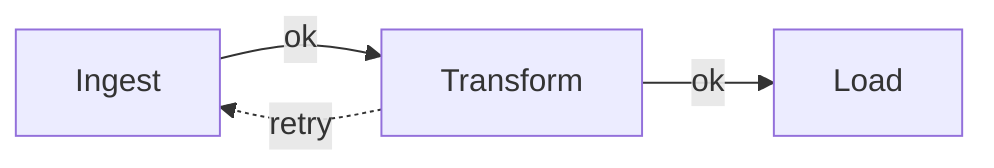

# Links, markers, labels & bend points

A link connects two endpoints. Those endpoints can be ports, whole nodes, or free-floating positions, and you
pick which by how you construct the `LinkModel`:

```csharp
diagram.Links.Add(new LinkModel(sourcePort, targetPort)); // port to port
diagram.Links.Add(new LinkModel(nodeA, nodeB));           // node to node, attaching at the boundary
```

A directed graph with a few of the features below looks like this:



## Markers

A marker is the little shape at a link's end — most often an arrowhead. You can put one on a single link, or set
a default that applies to every link in the diagram:

```csharp
diagram.Options.Links.DefaultTargetMarker = LinkMarker.Arrow; // arrows everywhere
link.TargetMarker = LinkMarker.Circle;                         // override one link
link.SourceMarker = LinkMarker.Square;
```

The built-in shapes are `Arrow`, `Square`, and `Circle`, and you can build your own with `LinkMarker.NewArrow`,
`NewRectangle`, or `NewCircle`. A marker is just neutral path data, so Nodely fills it for you and trims the line
back so it meets the marker cleanly rather than poking through it.

## Selecting links

Links are selectable. Click one and it highlights; press `Delete` and it's gone. The hit-testing is geometric —
Nodely measures how far the cursor is from the path itself — so it's accurate on curves and doesn't depend on
how the link happens to be drawn.

## Labels

You can place text along a link with `AddLabel`:

```csharp
link.AddLabel("approved");                                   // sits at the midpoint
link.AddLabel("retry", distance: 0.25, offset: new Point(0, -12));
```

The `distance` argument reads naturally once you know the rule: a value between 0 and 1 is a fraction of the
link's length, a value above 1 is an absolute distance measured from the start, a negative value is measured back
from the end, and leaving it null means the midpoint.

## Bend points

If you want users to reshape a link by hand, mark it `Segmentable` and it gains draggable bend points:

```csharp
link.Segmentable = true;
link.AddVertex(new Point(300, 120)); // start it off with one bend
```

In the editor, double-clicking a segmentable link drops a new bend point under the cursor, dragging a handle
moves it, and double-clicking a handle removes it. The link reroutes through its bends automatically.

## Routing and shape

Every link runs through two stages: a router decides the waypoints, and a path generator turns those into the
drawn curve. You can set the defaults for the whole diagram or override either one per link:

```csharp
using Nodely.Routers;
using Nodely.PathGenerators;

diagram.Options.Links.DefaultRouter = new OrthogonalRouter();         // or NormalRouter
diagram.Options.Links.DefaultPathGenerator = new SmoothPathGenerator(); // or StraightPathGenerator

link.Router = new NormalRouter();                  // just this link
link.PathGenerator = new StraightPathGenerator(radius: 8);
```

Both stages are open contracts, so a router or generator of your own slots straight in.
