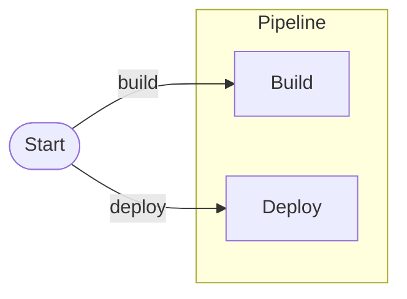

# Nodely

Nodely is a diagramming toolkit for [Avalonia](https://avaloniaui.net/). It gives you a canvas where users can
drag nodes around, wire them together, group them, and edit the result — the kind of surface you'd build a
workflow editor, a node graph, or a state-machine designer on top of.

It began life as a port of Blazor.Diagrams, but everything that tied that library to the browser is gone.
There is no SVG, no JavaScript, and no embedded WebView anywhere in Nodely. It is plain Avalonia drawing and
plain C# all the way down, so it runs wherever your Avalonia app runs — Windows, macOS, and Linux today.

Here is the kind of thing you'll be building:

## What it's good at

Two things shaped every decision in Nodely: it should stay fast even with thousands of elements, and it should
get out of your way when you want something custom.

For speed, the engine that holds your nodes and links knows nothing about Avalonia — it's a self-contained C#
model that you could run headless. Rendering is split deliberately: nodes are real Avalonia controls so you can
put anything inside them, while links and the grid are drawn in immediate mode so they stay cheap at scale.
Re-routing and generating smooth-bézier paths for a few thousand links takes a handful of milliseconds.

For customization, Nodely leans on a small set of seams rather than a pile of built-in options. You render a
node by handing back any Avalonia control; you change how links route, where they attach, or how they're drawn;
you add your own overlays and interaction rules. The [Extensibility](./guides/extensibility.md) guide is the
map of all of that.

You can write the whole UI in C# — no XAML required — and the models are ordinary objects, so Nodely doesn't
push you toward any particular MVVM pattern.

## The packages

Nodely ships as focused NuGet packages so you only take what you use:

| Package | Targets | What's inside |
| --- | --- | --- |
| `Nodely.Core` | netstandard2.0, net8.0, net10.0 | The UI-agnostic engine: geometry, models, behaviors, routers, path generators, commands |
| `Nodely.Avalonia` | net8.0, net10.0 | The `DiagramCanvas`, node/port/link/group rendering, adorners, the minimap, theming |
| `Nodely.Avalonia.Database` | net8.0, net10.0 | Optional side package: database table/view/procedure renderers, row-aware ports, and relationship links |
| `Nodely.Avalonia.MindMap` | net8.0, net10.0 | Optional side package: root, branch, and leaf topics, branch ports, curved links, collapse state, and arrange helpers |
| `Nodely.Avalonia.Network` | net8.0, net10.0 | Optional side package: network device renderers, typed ports, topology links, status badges, and arrange helpers |
| `Nodely.Avalonia.StateMachine` | net8.0, net10.0 | Optional side package: initial, state, final, choice, and note nodes, transition ports, transition links, self loops, and arrange helpers |
| `Nodely.Avalonia.Uml` | net8.0, net10.0 | Optional side package: compartmented UML renderers, row-aware ports, packages, notes, and relationship links |
| `Nodely.Avalonia.Workflow` | net8.0, net10.0 | Optional side package: workflow start, end, task, decision, gateway, event, note nodes, and workflow links |
| `Nodely.Serialization` | netstandard2.0, net8.0, net10.0 | Versioned JSON snapshots that round-trip exactly |
| `Nodely.Algorithms` | netstandard2.0, net8.0, net10.0 | Graph queries and a layered auto-layout |

Most apps reference `Nodely.Avalonia` (which brings in the core) and add the others as needed.

## Where to go next

The fastest way in is [Getting started](./getting-started.md) — a working canvas in a few lines. If you'd
rather start from a complete tiny app, run `samples/Nodely.QuickStart`. If you'd rather understand how the
pieces fit before writing code, the [Architecture](./architecture.md) page lays out the design. And when you're
ready to make Nodely your own, the guides cover [custom nodes](./guides/custom-nodes.md),
[links](./guides/links.md), [the database pack](./guides/database.md), [the UML pack](./guides/uml.md),
[the Workflow pack](./guides/workflow.md), [the MindMap pack](./guides/mindmap.md),
[the StateMachine pack](./guides/statemachine.md), [the Network pack](./guides/network.md),
[recipes](./guides/recipes.md), [undo/redo](./guides/undo-redo.md), and the rest.
